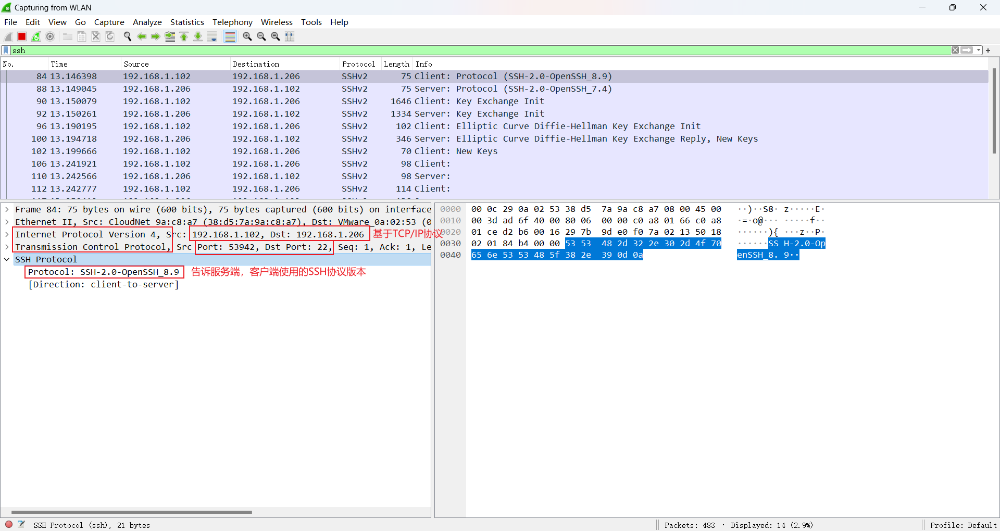
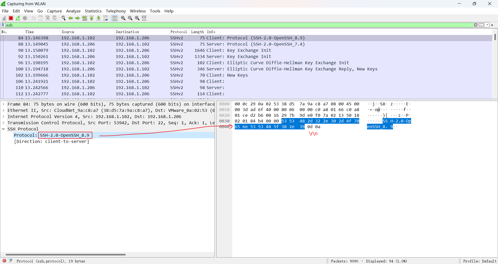
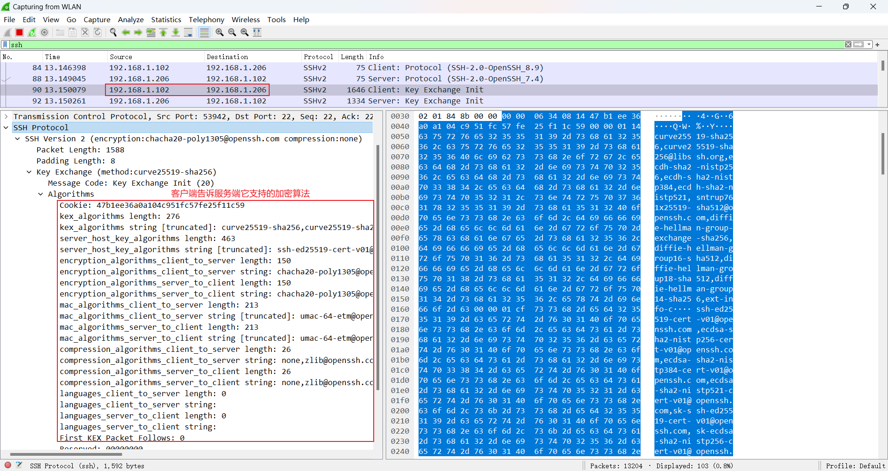
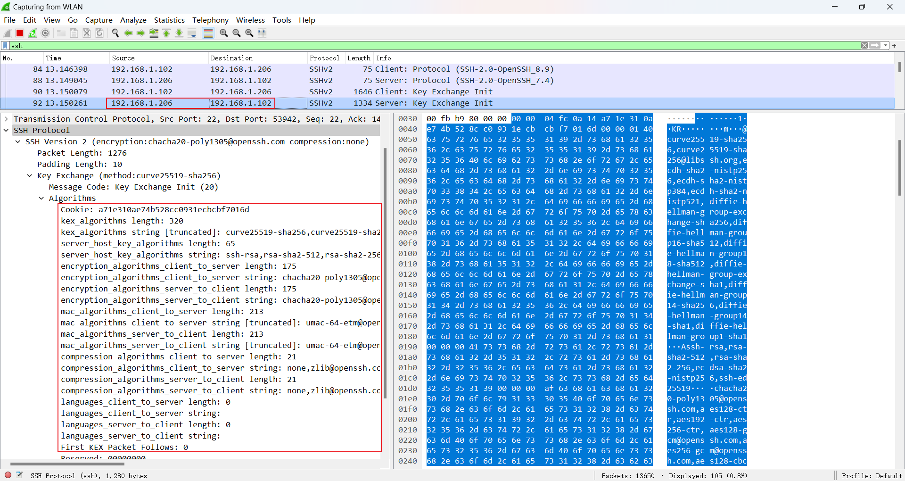
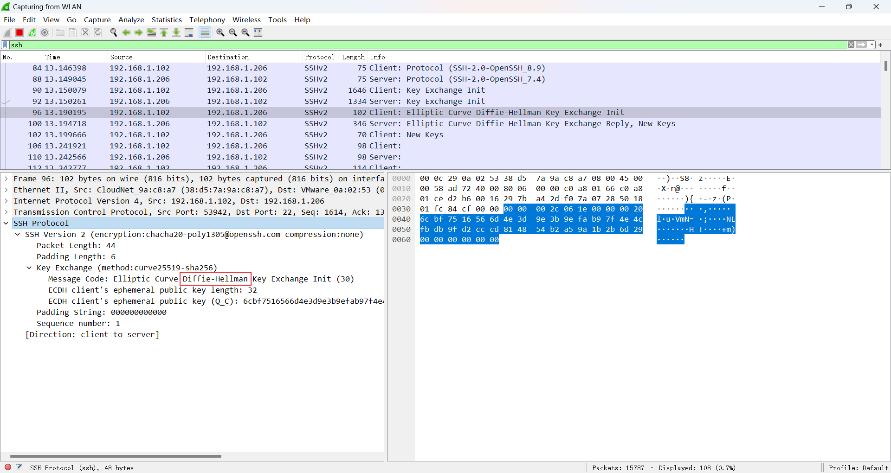
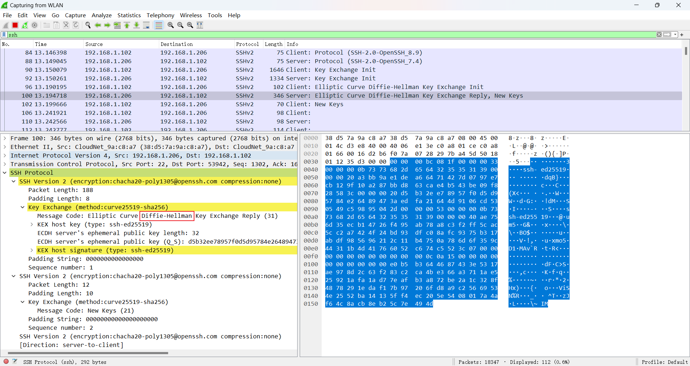
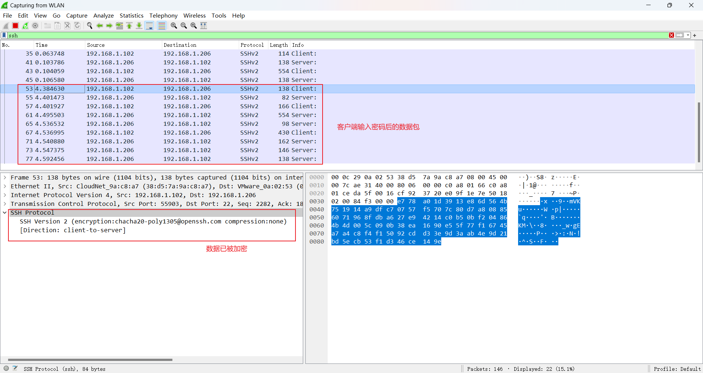
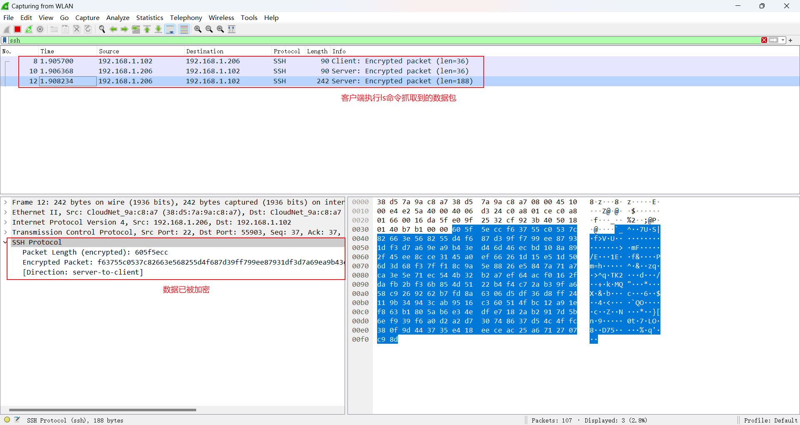
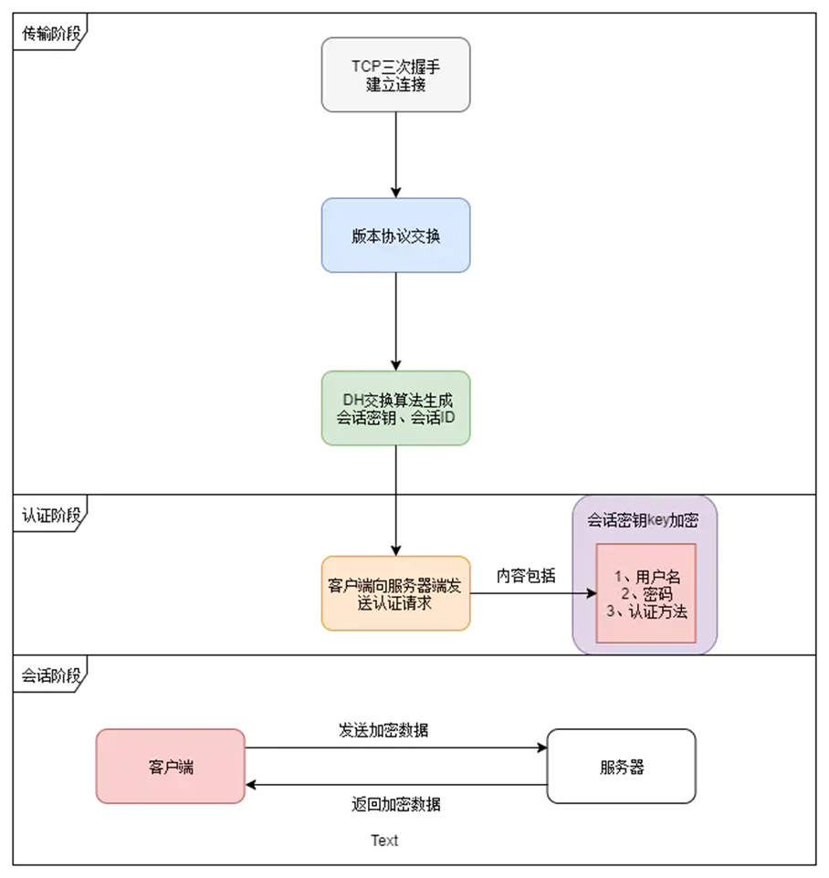

# SSHv2

RFC 4250 https://www.rfc-editor.org/rfc/rfc4250 Protocol Assigned Numbers               协议编号定义  
RFC 4251 https://www.rfc-editor.org/rfc/rfc4251 Protocol Architecture                   协议架构  
RFC 4252 https://www.rfc-editor.org/rfc/rfc4252 Authentication Protocol                 认证协议    
RFC 4253 https://www.rfc-editor.org/rfc/rfc4253 Transport Layer Protocol                传输层协议    
RFC 4254 https://www.rfc-editor.org/rfc/rfc4254 Connection Protocol                     连接协议    
RFC 5655 https://www.rfc-editor.org/rfc/rfc4255 Using DNS to Securely Publish Secure Shell (SSH) Key Fingerprints  
RFC 5656 https://www.rfc-editor.org/rfc/rfc4256 Generic Message Exchange Authentication 通用消息交换认证  

## 基于 TCP 协议

SSH 协议基于 TCP 协议 

TCP 协议基于 IP 协议

## Client/Server 架构

C/S 架构

## 连接过程

SSH 客户端 IP 192.168.1.102 

SSH 服务端 IP 192.168.1.206

`ssh root@192.168.1.206`

Wireshark 关键字过滤 ssh

1. 协商 SSH 协议版本，最后由客户端确定通信所用的SSH版本

客户端发送它的SSH协议版本给服务端

SSH-2.0-OpenSSH_8.9\r\n

服务端响应它的SSH协议版本给客户端

SSH-2.0-OpenSSH_7.4\r\n

> 现在基本都使用 SSHv2，不同SSH协议版本所规定的规则可能不同，所以需要协商

2. 协商加密算法，最后由客户端确定通信所用的加密算法

客户端告诉服务端它支持的加密算法

服务端响应客户端它支持的加密算法

3. 客户端发送Diffie-Hellman密钥交换算法初始化(Init)数据，服务端也响应Diffie-Hellman密钥交换响应(Reply)数据

4. 客户端发送加密后的数据给服务端，服务端响应加密后的数据给客户端 

客户端输入登录密码 root 

客户端执行 ls 命令

## 流程图

